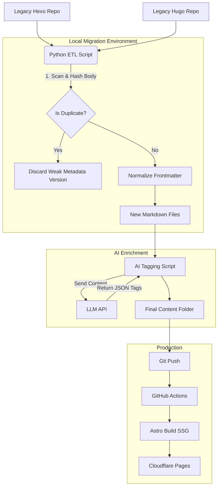

## refactor legacy blog
This Product Requirements Document (PRD) outlines the architecture and implementation plan for migrating your legacy Hexo/Hugo content to a modern, AI-enhanced Astro system.

-----

# PRD: Legacy Blog Modernization & AI Migration

| **Project Name** | Blog Modernization (Astro + AI) |
| :--- | :--- |
| **Status** | **Approved** |
| **Target Platform** | Cloudflare Pages (Static) |
| **Core Framework** | Astro (v5+) |
| **Primary Language** | TypeScript (Frontend), Python (Migration Scripts) |

-----

## 1. Problem Statement & Goals

**Problem:** The current blog content is fragmented across two legacy systems (Hexo and Hugo), containing duplicate entries, inconsistent metadata, and a disorganized tagging structure.
- **Legacy Hugo (`@[blog]`)**: Content located in `blog/content` and `blog/content/posts`.
- **Legacy Hexo (`@[blog_old]`)**: Content located in `blog_old/source/_posts`.

**Goal:** Create a unified, high-performance static site using Astro. Establish a Python-based pipeline to programmatically deduplicate content and use Generative AI to rebuild the taxonomy (tags) from scratch.

### Key Objectives
1.  **Scripts based solution:** For better stability, we need a robust script-based solution.
2.  **Unification:** Merge Hexo and Hugo repositories into a single source of truth in the new Astro project.
3.  **Sanitization:** Eliminate duplicate posts using content hashing (MD5).
4.  **Enrichment:** Replace low-quality legacy tags with AI-generated semantic tags.
5.  **Performance:** Achieve 100/100 Lighthouse scores via pure static generation (SSG).
6.  **Automation:** Deploy automatically to Cloudflare Pages via GitHub Actions.

-----

## 2. Technical Architecture

### 2.1 Stack Selection

  * **Base Theme:** [AstroPaper](https://github.com/satnaing/astro-paper) (Minimalist, Tailwind-based, SEO-focused).
  * **Hosting:** Cloudflare Pages.
  * **CI/CD:** GitHub Actions.
  * **Database:** None (Markdown/MDX files are the database).
  * **Migration Tooling:** Python 3.10+ (Libraries: `python-frontmatter`, `openai`, `pandas`, `pyyaml`).

### 2.2 System Diagram



-----

## 3. Feature Specifications

### 3.1 Feature: The "Unifier" (Deduplication Logic)

**Type:** Local Python Script (`scripts/unify.py`)
**Requirements:**

  * **Input:** 
    - Hugo: `blog/content/posts` (and potential subfolders).
    - Hexo: `blog_old/source/_posts`.
  * **Hashing:** Calculate MD5 hash of the *content body only* (strip whitespace, exclude Frontmatter).
  * **Conflict Resolution:** If Hash A == Hash B:
      * Compare `date`: Keep the oldest (original) date.
      * Compare `slug`: Keep the less complex/shorter slug.
  * **Assets/Images:** 
    - Parse markdown for image links ``.
    - Detect if local path.
    - Copy image to `public/assets/images/`.
    - Rewrite markdown path to `/assets/images/filename.ext`.
  * **Output:** A flat directory of `.md` files in `src/content/blog/`.

### 3.2 Feature: AI-Powered Taxonomist

**Type:** Local Python Script (`scripts/ai_tag.py`)
**Requirements:**

  * **Trigger:** Manual run via CLI.
  * **Logic:**
    1.  Read Markdown file.
    2.  Check if `tags` are empty or valid ("verified").
    3.  Extract `Title` and first 2,000 characters of `Body`.
    4.  Prompt LLM: *"Assign 3-5 technical tags from this predefined list [List] or generate new ones if strictly necessary. Return strictly JSON."*
    5.  Update the YAML Frontmatter of the file.
  * **Cost Control:** Skip files that already have "verified: true" in frontmatter (optional implementation detail).

### 3.3 Feature: Standardized Frontmatter Schema

All migrated files must be rewritten to match AstroPaper’s specific schema requirements:

```yaml
---
title: "Post Title"
author: "Robin"
pubDatetime: 2023-10-01T05:00:00Z  # ISO format is mandatory
slug: "post-title"                 # URL friendly
featured: false
draft: false
tags:
  - "python"
  - "automation"
description: "A short summary generated from the first paragraph."
---
```

### 3.4 Feature: Deployment Pipeline

**Type:** GitHub Action (`.github/workflows/deploy.yml`)
**Triggers:** Push to `main`.
**Steps:**

1.  **Checkout Code.**
2.  **Install Dependencies:** `npm ci`.
3.  **Build:** `npm run build` (Outputs to `/dist`).
4.  **Deploy:** Uses `cloudflare/pages-action` to push `/dist`.

-----

## 4. Migration Execution Plan (Step-by-Step)

### Phase 1: Setup & Cleaning
1.  Initialize AstroPaper repo in the root directory (ignoring legacy folders).
2.  Configure `astro.config.mjs` for pure static output.
3.  Develop and run `scripts/unify.py` locally to populate `src/content/blog`.
4.  Manual spot-check to ensure frontmatter and images are valid.

### Phase 2: AI Enrichment
1.  Set up OpenAI/LLM API Key.
2.  Run `scripts/ai_tag.py` on the newly unified folder.
3.  (Optional) Auto-generate descriptions.

### Phase 3: UI/UX Customization
1.  Modify `src/config.ts` (Site metadata, social links).
2.  Adjust Tailwind config (Colors/Fonts).

### Phase 4: CI/CD & Launch
1.  Push code to GitHub.
2.  Connect Cloudflare Pages.
3.  Verify DNS and SSL.

-----

## 6. Next Immediate Step

**Generate the `unify.py` script.** This is the blocker for everything else, as it handles the logic to merge the Hexo and Hugo directories while preventing duplicates.